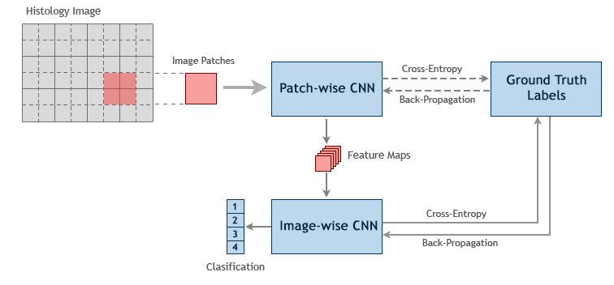
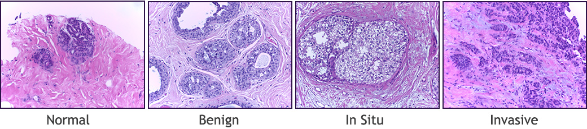

# ICIAR2018
### Two-Stage Convolutional Neural Network for Breast Cancer Histology Image Classification
This repository is the part A of the ICIAR 2018 Grand Challenge on BreAst Cancer Histology (BACH) images for automatically classifying H&E stained breast histology microscopy images in four classes: normal, benign, in situ carcinoma and invasive carcinoma. 

We are presenting a CNN approach using two convolutional networks to classify histology images in a patchwise fashion. The first network, receives overlapping patches (35 patches) of the whole-slide image and learns to generate spatially smaller outputs. The second network is trained on the downsampled patches of the whole image using the output of the first network. The number of channels in the input to the second network is equal to the total number of patches extracted from the microscopy image in a non-overlapping fashion (12 patches) times the depth of the feature maps generted by the first network (C): 
<p align='center'>  
  
</p>

## Prerequisites
- Linux
- Python 3
- NVIDIA GPU (12G or 24G memory) + CUDA cuDNN

## Getting Started
### Installation
- Clone this repo:
```bash
git clone https://github.com/ImagingLab/ICIAR2018
cd ICIAR2018
```
- Install PyTorch and dependencies from http://pytorch.org
- Install python requirements:
```bash
pip install -r requirements.txt
```

### Dataset
- We use the ICIAR2018 dataset. To train a model on the full dataset, please download it from the [official website](https://iciar2018-challenge.grand-challenge.org/dataset/) (registration required). The dataset is composed of 400 high resolution Hematoxylin and Eosin (H&E) stained breast histology microscopy images labelled as normal, benign, in situ carcinoma, and invasive carcinoma (100 images for each category):
<p align='center'>  
  
</p>
After downloading, please put it under the `datasets` folder in the same way the sub-directories are provided.


### Testing
- The pre-trained ICIAR2018 dataset model resides under `./checkpoints`.
- To test the model, run `test.py` script
- Use `--testset-path` command-line argument to provide the path to the `test` folder.
```bash
python test.py --testset-path ./dataset/test 
```
- If you don't provide the test-set path, an open-file dialogbox will appear to select an image for test.
The test results will be printed on the screen.


### Training
- To train the model, run `train.py` script
```bash
python train.py
```
- To change the number of feature-maps generated by the patch-wise network use `--channels` argument:
```bash
python train.py --channels 1
```


### Validation & ROC Curves
- To validate the model on the validation set and plot the ROC curves, run `validate.py` script
```bash
python validate.py
```
- To change the number of feature-maps generated by the patch-wise network use `--channels` argument:
```bash
python train.py --channels 1
```

## Citation
If you use this code for your research, please cite our paper <a href="https://arxiv.org/abs/1803.04054">Two-Stage Convolutional Neural Network for Breast Cancer Histology Image Classification</a>:

```
@inproceedings{nazeri2018two,
  title={Two-Stage Convolutional Neural Network for Breast Cancer Histology Image Classification},
  author={Nazeri, Kamyar and Aminpour, Azad and Ebrahimi, Mehran},
  booktitle={International Conference Image Analysis and Recognition},
  pages={717--726},
  year={2018},
  organization={Springer}
}
```
